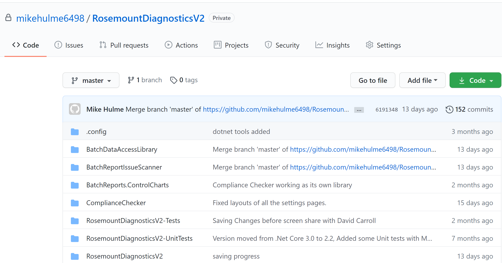

# APOS-Automatic Process Optimization System

This project was deisgned to take an old process reporting system and bring it into the the modern age, with real-time feedback on process performance and quality.  

This application reads raw text file reports produced by the system and converts them into digital data stored in a database for a fully featured diagnostics system.

Watch a video demo here : https://www.youtube.com/watch?v=8UuJjG11PVg&ab_channel=MikeHulme

### Please note some features have been removed. The program has also been modified to store the data in memory rather than a database to save any setting up.

#### Download test report files here. (in the software you upload them under settings - upload new batch reports

As stated above this is a modified version to show to the public, thefore there are not many commits. The private version has many commits.

